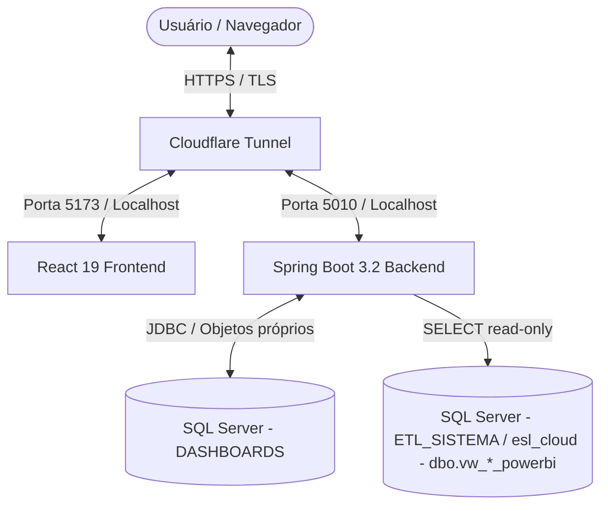

# 📈 Portal de Dashboards & Monitoramento ETL - Monorepo

> **Atenção:** Este é um Monorepo empresarial composto por um backend Spring Boot robusto e um frontend React de alta performance, projetado para consolidar indicadores operacionais, financeiros, de auditoria e de saúde de processos ETL da **RodoGarcia**.

---

## 🗺️ Visão Geral & Arquitetura do Sistema

O portal centraliza a inteligência de negócios e a auditoria operacional da empresa. Ele é uma camada de apresentação, autorização e operação: consome dados refinados a partir das views publicadas pelo **ETL Extração de Dados**, aplica ACL (Access Control Lists) e expõe uma experiência de usuário rica em gráficos, tabelas e filtros integrados.

O Dashboard não é dono do pipeline analítico nem das views de BI do ETL. Ele mantém apenas seus objetos próprios de aplicação, como acesso, auditoria administrativa, metas e configurações internas.

### Fluxo de Comunicação e Segurança



---

## 🏛️ Arquitetura, Banco de Dados e SSOT

O **Flyway** em `database/migrations` é a **única fonte de verdade estrutural** dos objetos pertencentes ao Dashboard. Toda criação, alteração ou remoção de schema, tabela, índice, constraint, seed estrutural ou view própria deve entrar como migration versionada.

DDL em runtime via Java é proibido. O backend roda com `spring.jpa.hibernate.ddl-auto=none`; classes de validação de schema podem apenas verificar contratos e falhar de forma explícita quando uma migration obrigatória não foi aplicada. Elas não devem executar `CREATE`, `ALTER`, `DROP` ou sincronizações estruturais.

O banco `DASHBOARDS` concentra os objetos próprios da aplicação, especialmente o schema `acesso` e estruturas administrativas. As views analíticas `dbo.vw_*_powerbi` e `dbo.vw_dim_*` são contrato publicado pelo projeto **ETL Extração de Dados** no banco/schema `ETL_SISTEMA` (`esl_cloud`) e devem ser consumidas em modo somente leitura.

O usuário de runtime da API deve operar com privilégio mínimo. Permissões DDL são reservadas à execução controlada de migrations, nunca ao fluxo normal da aplicação.

---

## 🔌 Integração com ETL e Performance

O Dashboard é estritamente **consumidor** das views do ETL. Alterações em tabelas base, views `vw_*_powerbi`, views dimensionais, materializações ou regras estruturais de BI pertencem ao projeto `etl-extracao-dados`.

O processamento de dados para painéis recorrentes deve acontecer no banco, por meio de projeções SQL, views, queries agregadas e paginação SQL. Agregações, filtros, rankings, `DISTINCT`, somatórios e recortes de período não devem ser feitos carregando grandes volumes na memória da JVM.

A responsabilidade do backend do Dashboard é autenticar, autorizar, aplicar escopo de acesso, montar filtros seguros, chamar as projeções SQL corretas, mapear DTOs e devolver respostas pequenas e previsíveis ao frontend.

---

## 🧭 Escopo e Recursos do Portal

### 🔒 9 Áreas Operacionais Protegidas
O frontend implementa roteamento seguro e autorização granular por setor para nove painéis críticos:
1. **Coletas**: Monitoramento de agendamentos, carregamento, performance e ranking de coletores.
2. **Manifestos**: Status de expedição, vinculação operacional e rotas ativas.
3. **Fretes**: Análise financeira de fretes contratados e liquidações.
4. **Tracking**: Rastreamento em tempo real de viagens, paradas e SLA de entrega.
5. **Performance**: Tabela analítica e cálculo de percentual de reprovação e KPIs de performance operacional.
6. **Contas a Pagar**: Lançamentos, provisões de saídas e fluxo de caixa operacional.
7. **Cotações**: Taxa de conversão de propostas comerciais e volumetria.
8. **Executivo**: Dashboard consolidado de KPIs estratégicos para a diretoria.
9. **ETL Saúde**: Monitoramento de integridade das sincronizações diárias (GraphQL e Data Export), contagem de órfãos e falhas de processo.

### 🛠️ Área Administrativa & ACL
* **Gestão de Setores**: Criação de agrupamentos operacionais com permissões específicas.
* **Gestão de Usuários**: Cadastro com definição de perfis, senhas fortes obrigatórias com validações no servidor e controle de status.
* **Autenticação Avançada**: Sessões baseadas em tokens JWT com refresh token rotativo para evitar expirações abruptas.

---

## 🛠️ Tecnologias Utilizadas (Tech Stack)

### ☕ Backend
* **Java 17 & Spring Boot 3.2.5**
* **Spring Security & Spring Data JPA**
* **Microsoft JDBC Driver para SQL Server**
* **Flyway** (`database/migrations`) como SSOT estrutural do banco do Dashboard.
* **JWT (JSON Web Tokens - `jjwt-api` / `jjwt-impl`)** para controle de sessões sem estado.
* **Spring Boot Actuator**: Monitoramento de integridade e endpoints de liveness/readiness.

### ⚛️ Frontend
* **React 19 & TypeScript & Vite**
* **React Router DOM v6** (controle de rotas e rotas protegidas)
* **TanStack Query (React Query) v5** para cache inteligente de requisições de API.
* **Axios** para cliente HTTP com interceptores automáticos de refresh token.
* **Apache ECharts**: Biblioteca avançada de visualização de dados e gráficos interativos.
* **Tailwind CSS v4** para estilização de interface ultra-rápida e moderna.

---

## 📐 Governança de KPIs e Tooltips

As regras matemáticas dos KPIs são definidas na camada de dados e expostas pela API. A explicação apresentada ao usuário fica centralizada em:

- `frontend/src/constants/kpiDictionary.ts`: títulos, descrições, fórmulas e observações de negócio.
- `frontend/src/components/shared/TooltipKpi.tsx`: apresentação acessível das definições nos cards, com suporte a hover e foco.

Qualquer alteração de fórmula, numerador, denominador, unidade, arredondamento, status, exclusão, deduplicação, calendário ou período de referência deve atualizar o `kpiDictionary.ts` na mesma entrega. Também é obrigatório conferir todos os cards que usam aquela definição.

O `TooltipKpi.tsx` deve ser atualizado quando houver mudança no contrato visual, nos campos exibidos ou no comportamento do tooltip. O texto das regras não deve ser duplicado dentro do componente: a fonte central da explicação continua sendo o dicionário.

Uma mudança de KPI só está concluída quando:

1. A regra na camada de dados e o retorno da API estão corretos.
2. A definição correspondente no `kpiDictionary.ts` descreve exatamente a nova regra.
3. Os cards continuam envolvidos pelo `TooltipKpi`.
4. TypeScript, lint, build e testes do frontend foram executados.

---

## ⚙️ Variáveis de Ambiente & Configurações

O monorepo separa os arquivos de ambiente por finalidade:

- `.env`: reservado para produção/Cloudflare.
- `.env.development`: versionado, usado apenas pelo Vite dev para apontar para `http://127.0.0.1:5011`.
- `.env.development.local`: ignorado pelo Git, usado pelo backend DEV com credenciais e banco separados. Copie de `.env.development.local.example`.

### Template de Configurações DEV (`.env.development.local`)

```properties
# --- Servidor do Backend API ---
SERVER_ADDRESS=127.0.0.1
API_BASE_URL=http://127.0.0.1:5011
VITE_API_BASE_URL=http://127.0.0.1:5011

# --- Banco de Dados Principal ---
DB_URL=jdbc:sqlserver://HOST_DEV:1433;databaseName=DASHBOARDS_DEV;encrypt=true;trustServerCertificate=true
DB_USER=seu_usuario
DB_PASSWORD=sua_senha

# --- Chaves de Segurança ---
JWT_SECRET=segredo-forte-unico-por-ambiente-gerado-com-sha256
API_KEY=chave-forte-unica-para-comunicacao-entre-servicos-internos

# --- Controle de CORS ---
CORS_ORIGENS_PERMITIDAS=http://localhost:5174,http://127.0.0.1:5174

# --- Parâmetros Extras de Sessão ---
AUTH_SESSION_EXPIRACAO_HORAS=24
AUTH_REFRESH_COOKIE_SAME_SITE=Lax
AUTH_REFRESH_COOKIE_SECURE=false

# --- Migração Temporária ---
ACL_LEGACY_MIGRATION_ENABLED=false
```

Para desenvolvimento, `DB_URL` deve ficar em `.env.development.local` e usar `databaseName` diferente de `DASHBOARDS`, por exemplo `DASHBOARDS_DEV`. O backend aborta o startup se o profile `dev` tentar usar o banco de produção.

> [!WARNING]
> **Segurança em Produção:**
> * Nunca versione credenciais reais ou chaves criptográficas no Git.
> * Em produção, mude `CORS_ORIGENS_PERMITIDAS` para apontar exclusivamente para a URL do domínio final: `https://analytics.rodogarcia.com.br`.
> * Para Cloudflare Tunnel com terminação SSL externa, mantenha `AUTH_REFRESH_COOKIE_SAME_SITE=None` ou `Lax` dependendo da arquitetura cross-site, com `AUTH_REFRESH_COOKIE_SECURE=true`.

---

## 📁 Estrutura de Pastas do Monorepo

```text
dashboards/
├── .vscode/               # Configurações recomendadas para o VS Code
├── backend/               # Código-fonte da API Spring Boot
│   ├── .mvn/              # Wrapper do Maven
│   ├── logs/              # Arquivos de log gerados em tempo de execução
│   ├── src/               # Código Java 17 e Migrations do Flyway
│   ├── storage/           # Artefatos locais ignorados pelo Git
│   ├── mvnw.cmd           # Executável do Maven no Windows
│   └── pom.xml            # Gerenciador de dependências Maven
├── frontend/              # Código-fonte da aplicação React
│   ├── dist-prod/         # Build estático gerado exclusivamente por iniciar-prod.bat
│   ├── node_modules/      # Dependências do Node.js
│   ├── public/            # Ativos públicos (favicons, imagens estáticas)
│   ├── src/               # Componentes, Páginas, Hooks e Contexts React
│   ├── package.json       # Configuração de scripts e dependências do Node.js
│   └── vite.config.ts     # Configurações do Vite
├── public/                # Ativos compartilhados do monorepo
├── docs/                  # Documentações funcionais e técnicas consolidada
├── iniciar-dev.bat        # Inicializador rápido para ambiente local (Dev)
└── iniciar-prod.bat       # Script de build e verificação de integridade (Prod)
```

---

## 🚀 Como Executar o Projeto

### Modo Automático (Windows)

#### 💻 Ambiente de Desenvolvimento
Para subir o frontend e o backend em paralelo, com recarregamento rápido (Hot Reload), execute no PowerShell/CMD na raiz:
```powershell
.\iniciar-dev.bat
```
* O backend subirá na porta `5011` (`http://localhost:5011`).
* O frontend subirá na porta `5174` (`http://localhost:5174`).

#### Acesso em outra máquina pelo Ports do VS Code

Com o ambiente DEV em execução, encaminhe a porta **5174** no painel **Ports** e abra o endereço HTTPS gerado na outra máquina. Mantenha a visibilidade **Private** e autentique-se na conta usada no VS Code. Basta encaminhar o frontend: as chamadas `/api/...` passam pelo proxy do Vite até `127.0.0.1:5011` na máquina do projeto, incluindo login, refresh e downloads. A API DEV precisa continuar em execução nessa máquina.

O navegador usa a mesma origem da página em DEV. `VITE_API_BASE_URL` continua restrita à API local `5011`, preservando a validação de isolamento; produção continua usando sua URL HTTPS externa. Não substitua essa variável pelo endereço de um segundo túnel.

Normalmente o VS Code reescreve os cabeçalhos para localhost. Se houver `Blocked request` por hostname ou `Origem não autorizada no proxy de desenvolvimento`, configure apenas a origem exata do seu túnel em `.env.development.local` na raiz (arquivo ignorado pelo Git):

```dotenv
DASHBOARD_DEV_TUNNEL_ORIGIN=https://SEU-TUNEL-5174.brs.devtunnels.ms
```

Use o endereço atual, sem `/login` ou outros caminhos, e atualize-o se o túnel mudar. A opção é exclusiva do servidor DEV; não permite outros túneis e não altera o CORS do backend. Após mudanças, recarregue a página para obter o código atualizado. O diagnóstico e os testes estão em [docs/acesso-tunel-vscode-2026-09-10.md](docs/acesso-tunel-vscode-2026-09-10.md).

#### 🏭 Ambiente de Produção (Homologação / VM)
Para compilar e subir o bundle otimizado simulando o ambiente de produção localmente ou na VM:
```powershell
.\iniciar-prod.bat
```
* O script valida se as variáveis necessárias estão ativas.
* Compila o frontend gerando a pasta `dist-prod`.
* Valida a inicialização da API na porta de produção `5010`.
* Executa testes automáticos de integridade (preflight CORS) antes de finalizar.

---

### Execução Manual

#### ☕ Iniciando o Backend
1. Navegue até a pasta do backend:
   ```powershell
   cd .\backend
   ```
2. Inicialize o serviço em modo desenvolvimento:
   ```powershell
   .\mvnw.cmd spring-boot:run
   ```
3. Para executar o JAR empacotado explicitamente no Windows:
   ```powershell
   & "$env:JAVA_HOME\bin\java.exe" -jar .\target\dashboard-api-1.0.0.jar
   ```

#### ⚛️ Iniciando o Frontend
1. Navegue até a pasta do frontend:
   ```powershell
   cd .\frontend
   ```
2. Instale as dependências (caso seja a primeira execução ou após atualizações):
   ```powershell
   npm install --legacy-peer-deps
   ```
3. Execute o servidor de desenvolvimento Vite:
   ```powershell
   npm run dev
   ```

---

## 🌐 Configuração de Produção & Cloudflare Tunnel

Ao subir o ambiente em VM utilizando o **Cloudflare Tunnel**, garanta o alinhamento de portas e segurança:

1. **API Backend**: Responde localmente a requisições do túnel. Configure `SERVER_ADDRESS=127.0.0.1` e porta `5010`.
2. **Políticas de CORS**: Apenas a URL externa do front-end deve constar nas origens permitidas (`https://analytics.rodogarcia.com.br`).
3. **Cabeçalhos Proxy**: Habilite `SECURITY_TRUST_FORWARDED_HEADERS=true` no `.env` do backend para interpretar corretamente IPs de clientes vindos de trás do Cloudflare Tunnel.

---

## 🔑 Segurança da Sessão e Usuário Supremo

O portal implementa proteção estrita contra roubo de tokens e vazamento de privilégios:

* **Access Token JWT em memória volátil**: O token de acesso fica apenas em memória da aplicação React, encapsulado em closure no gerenciador de sessão. Ele não é persistido pelo navegador, reduzindo a janela de impacto em caso de XSS.
* **Refresh Token Rotativo em Cookie HttpOnly**: O refresh token é emitido em cookie `HttpOnly` e `Secure` em produção, bloqueando acesso por scripts JS.
* **F5 e restauração de sessão**: Ao recarregar a página, o React não reidrata JWT persistido. A restauração depende exclusivamente do cookie `HttpOnly` de refresh token e do endpoint `/api/auth/refresh`. Se o cookie estiver ausente, expirado ou revogado, o usuário precisa autenticar novamente.
* **Renovação Silenciosa**: Enquanto a sessão absoluta permanecer válida, o frontend tenta renovar o access token antes da expiração ou após `401`, usando o cookie de refresh sem expor o segredo ao JavaScript.
* **Usuário Supremo de Backup**: Credenciais para recuperação emergencial da ACL e acesso administrativo. As credenciais nunca ficam chumbadas no código, sendo lidas de variáveis de ambiente:
  ```properties
  ACESSO_USUARIO_SUPREMO_EMAIL=supremo@suaempresa.com
  ACESSO_USUARIO_SUPREMO_SENHA=senha-super-secreta
  VITE_ACESSO_USUARIO_SUPREMO_PAPEL=ROLE_ADMIN
  ```

---

## 🛠️ Resolução de Problemas & Encoding SQL Server

### Textos Corrompidos na Área Administrativa (Mojibake)
Se você identificar acentos ou cedilhas quebrados nas descrições de setores ou permissões vindas do SQL Server local devido à colação (Collation) incorreta, execute o script corretivo de migração:

```sql
-- Executar no banco de dados DASHBOARDS
-- Localizado em: database/migrations/V004__corrigir_mojibake_acesso.sql
```

Para conferir se restam registros inconsistentes no banco, utilize a query de auditoria:
```sql
SELECT 'setores.nome' AS alvo, COUNT(*) AS qtd FROM acesso.setores
WHERE nome COLLATE Latin1_General_100_BIN2 LIKE N'%' + NCHAR(195) + N'%' OR nome COLLATE Latin1_General_100_BIN2 LIKE N'%' + NCHAR(194) + N'%'
UNION ALL
SELECT 'setores.descricao', COUNT(*) FROM acesso.setores
WHERE descricao COLLATE Latin1_General_100_BIN2 LIKE N'%' + NCHAR(195) + N'%' OR descricao COLLATE Latin1_General_100_BIN2 LIKE N'%' + NCHAR(194) + N'%'
UNION ALL
SELECT 'papeis.descricao', COUNT(*) FROM acesso.papeis
WHERE descricao COLLATE Latin1_General_100_BIN2 LIKE N'%' + NCHAR(195) + N'%' OR descricao COLLATE Latin1_General_100_BIN2 LIKE N'%' + NCHAR(194) + N'%'
UNION ALL
SELECT 'permissoes.nome', COUNT(*) FROM acesso.permissoes
WHERE nome COLLATE Latin1_General_100_BIN2 LIKE N'%' + NCHAR(195) + N'%' OR nome COLLATE Latin1_General_100_BIN2 LIKE N'%' + NCHAR(194) + N'%';
```

---

## 📚 Documentação de Apoio Detalhada

Para aprofundar-se em aspectos técnicos específicos, consulte os relatórios técnicos e guias salvos no diretório `/docs`:

* 📂 [Guia Geral de Documentos](docs/README.md): Índice principal de arquivos.
* 🏛️ [Visão Geral da Arquitetura](docs/arquitetura/01-visao-geral.md): Trilha canônica do projeto Dashboard.
* 🔒 [Segurança e Acesso](docs/arquitetura/04-seguranca-e-acesso.md): Sessão, JWT em memória, refresh cookie, papéis e permissões.
* ⚙️ [Filtros, Períodos e Semântica de Dados](docs/arquitetura/05-filtros-e-dados.md): Regras de datas, filtros e validação BI.
* 📊 [Catálogo de Dashboards e Endpoints](docs/catalogos/01-dashboards-e-endpoints.md): Endpoints e permissões publicados para a UI.
